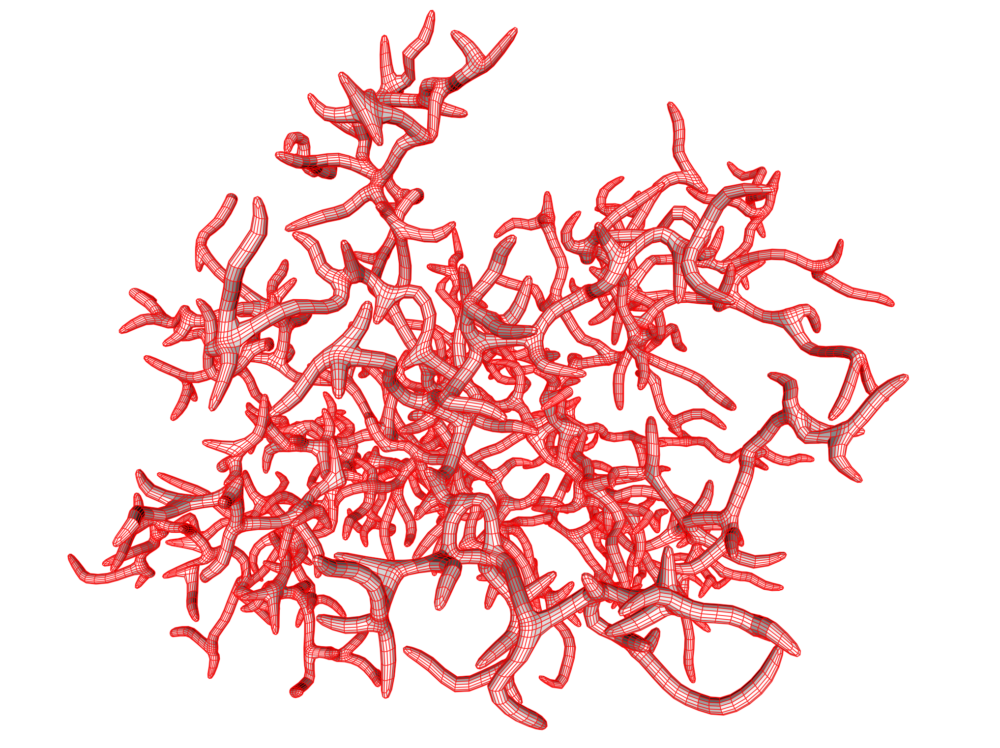

# GEL
GEL is a C++ library of geometry processing tools mostly intended for computer graphics applications. Python bindings for GEL are found in the included PyGEL library which is also available from PyPI under the package name PyGEL3D.



GEL contains 
- a fairly mature half-edge based polygonal mesh data structure which includes functions for traversing a mesh and a rich library of methods for modifying meshes, 
- a graph data structure which is also specialized for spatial graphs,
- voxel grid data structures, 
- spatial data structures for triangles and points: BSP tree, bounding box hierarchy, and a kD-Tree in particular, 
- a linear algebra library for small vectors and matrices (2D, 3D, and 4D),
- tools for visualization based on OpenGL and tools based on Plotly for visualization in Jupyter notebooks, and
- various utilities.

Unique functionality includes
- Local Separator Skeletonization: our graph-based skeletonization method that works on both meshes, voxel data, and point clouds, although you need to specify the connectivity for the latter two.
- Inverse skeletonization: Face extrusion quad meshes (FEQ) from graphs.
- Rotation System Reconstruction: a combinatorial method for reconstruction from point clouds.

There are several less unique but important features:
- Garland-Heckbert simplification of triangle meshes, 
- signed distance field (SDF) computation from triangle meshes, 
- iso-surface polygonization for regular voxel grids: can produce both dual and primal connectivity, 
- edge flipping-based optimization for triangle meshes, 
- mesh smoothing: we include anisotropic smoothing, Taubin smoohing, and more.
- topological analysis: a single (Python) function splits a mesh into components and analyses each.

GEL requires a recent C++ compiler but has very few dependencies. For visualization, OpenGL and GLFW are required, but these dependencies can be omitted if visualization is not needed. The basic philosophy is that GEL should have few dependencies itself since it is better that projects which use GEL can choose for themselves, say, which linear algebra package to use. 

### PyGEL
PyGEL is a set of Python bindings for a _subset_ of the features in GEL. In particular, PyGEL covers almost all the mesh features. In addition PyGEL has its own viewer based on OpenGL, and PyGEL can be used from Jupyter notebooks. In this case, it is possible to visualize meshes using a plotly widget. A significant benefit here is that when the notebook is exported to HTML, the 3D view comes along. In fact, this makes PyGEL a useful tool for teaching geometry processing since work can be carried out in a Jupyter notebook and assignments submitted as HTML files. Moreover, PyGEL works in Google [colab](https://colab.research.google.com) notebooks.

## DOCUMENTATION
Some installation instructions below. But for more documentation please see the doc directory. There is a doxygen script for creating a reference manual and a latex file intro.tex which explains the basics. Please doxygen or pdflatex your documentation. A license is also found in the intro document.

## INSTALLING PYGEL WITH PIP

PyGEL is on PyPI and can be installed with pip. For most potential users, there is no reason to look further than:
```
pip install PyGEL3D
```
The PyPI package is called PyGEL3D and not PyGEL. The library relies on OpenGL. Probably this is already installed, but you may have to do it. On Ubuntu Linux 
```
sudo apt-get install libglu1 libgl1
```
should suffice. On Google Colab, I recommend having this as the first cell:
```
!apt-get install libglu1 libgl1
!pip install PyGEL3D
```
Note that to make PyGEL work, we have to include compiled versions of the C++ library. If you use Windows, MacOS or something compatible with Ubuntu, chances are you are covered by the binaries. In other cases, you may need to compile as discussed below in order to make PyGEL work.

## BUILDING AND INSTALLING GEL AND PYGEL

If you need or wish to build GEL/PyGEL from source, please download or clone it from [https://github.com/janba/GEL](https://github.com/janba/GEL). Below you will find instructions for how to build and create a package for PyGEL that can be installed via pip. If you look around you will find some other build options for Windows, Mac and Linux. Since GEL is primarily developed on Mac OS, the Xcode projects are actively maintained and cover everything. **The two last build options are not actively maintained**. However, they may prove of some use and hence not removed.

### Building with CMake
If you are using a unix-like command line, build with
```
mkdir build; cd build; cmake ..; make -j 8 ; sudo make install; cd ..
```
### Creating a PyGEL3D package and installing it
You can next issue the command
```
python -m build -nwx
```
Install using something like
```
pip install dist/PyGEL3D-*.whl
```
For this to work, you need to have `wheel`, `setuptools`, and `build` installed. Also `python` and `pip` should be version 3 variants. There is shell script called `build_pygel.sh` that automates the tasks above. If you want to build PyGEL with a minimum of fuss, type 
```
sh build_pygel.sh
```
If you run this script the C++ code is compiled and then the PyGEL3D wheel is created and installed. If the PyGEL3D package is already installed it will be replaced.

## Compilation of Demos and Tests

GEL comes with some test scripts and also demos. You can find these in `GEL/src/test` and `GEL/src/demo`. There are individual CMake files for these tests and demos, and they are not compiled as a part of compiling the main library.

## Practical Issues
Compiling both GEL and PyGEL requires that you have OpenGL installed unless you choose not to compile graphics support which you can do by setting `Use_GLGraphics` to `OFF` in the CMake file. GLFW is also needed, but CMake fetches GLFW from github and compiles it along with the GEL code. If you compile in some of the other ways (e.g. using XCode, Visual Studio) there is no simple way to avoid the dependency on graphics libraries. Thus, if you need to avoid the OpenGL requirements, CMake is the way to go.

GEL comes with a few demo applications. In addition to the requirements above, several of these also require GLUT to be installed. Going forward, we should remove the GLUT dependency and move to GLFW for the applications.

PyGEL has a module called `jupyter_display` which produces graphics suitable for Jupyter notebooks. This module is based on `plotly` which must then be installed for it to work. You will also need `numpy`. However, if you use `pip`, these required libraries will be downloaded automatically when you install PyGEL.
